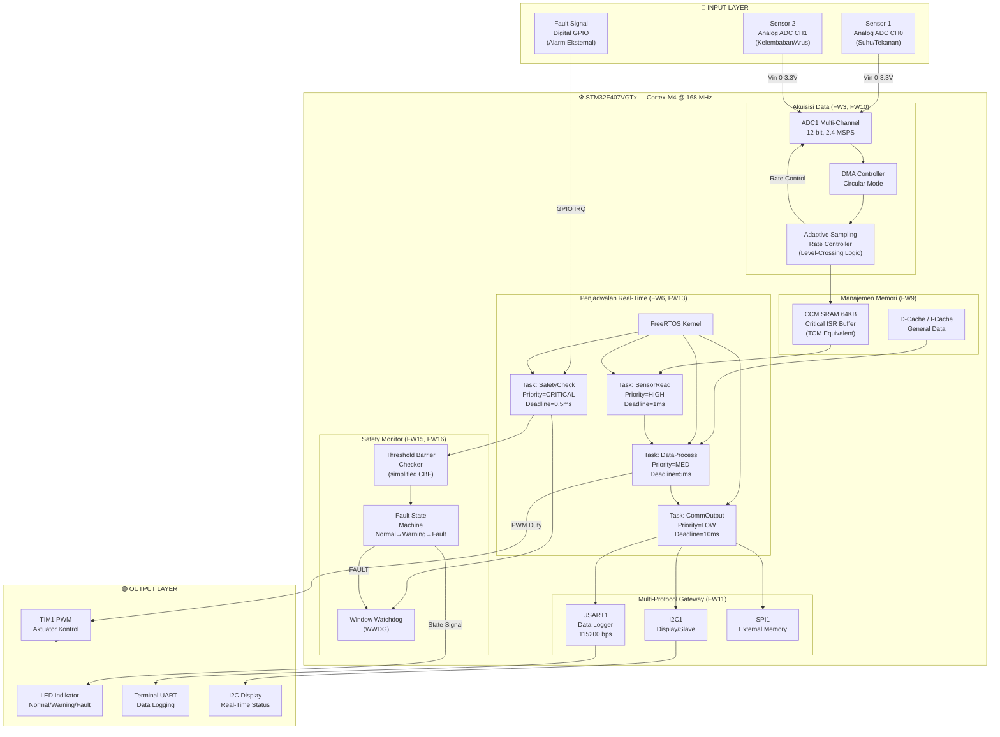
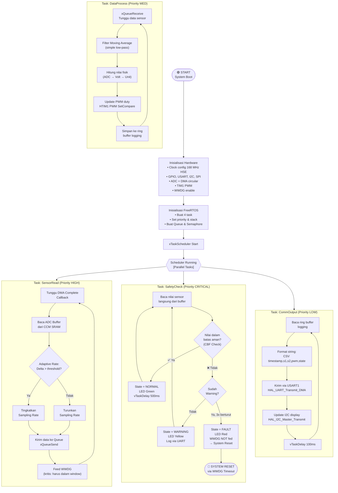

# Metode Baru — Perancangan Sistem

## Judul Metode

> **"Adaptive Safety-Critical Multi-Sensor Acquisition Framework with Priority-Deadline Hybrid Scheduling and Hybrid Memory Optimization on STM32F407VGTx"**
>
> *(Kerangka Kerja Akuisisi Multi-Sensor Safety-Critical Adaptif dengan Penjadwalan Hibrid Prioritas-Deadline dan Optimasi Memori Hybrid pada STM32F407VGTx)*

---

## Latar Belakang & Motivasi

Sistem embedded modern menghadapi tiga tantangan utama secara bersamaan:
1. **Keandalan akuisisi data** — sampling ADC dengan rate adaptif untuk menghemat energi sekaligus menjaga akurasi sinyal
2. **Penjadwalan task real-time** — kebutuhan memenuhi *hard deadline* dan *soft deadline* secara bersamaan tanpa kelaparan (starvation)
3. **Keselamatan sistem (safety)** — jaminan formal bahwa sistem tidak melanggar batas keamanan meskipun terjadi gangguan

Metode ini menggabungkan **16 future work** dari literatur menjadi satu sistem terintegrasi yang dapat disimulasikan pada **STM32F407VGTx** menggunakan **FreeRTOS + HAL**.

---

## Peta Kontribusi Future Work → Komponen Sistem

| Komponen Sistem | Sumber FW |
|-----------------|-----------|
| Adaptive ADC DMA dengan rate variabel | FW3, FW10 |
| Hybrid TCM (CCM) + Cache memory placement | FW9 |
| Priority-Deadline hybrid scheduler (FreeRTOS) | FW6, FW13 |
| Modular C firmware (SOLID principles) | FW12, FW14 |
| Multi-protocol gateway (UART + I2C + SPI) | FW11 |
| Safety barrier monitoring (Watchdog + threshold CBF) | FW15 |
| Secure logging & error state machine | FW7, FW16 |
| Analisis energi & DVFS-lite via clock gating | FW5, FW13 |
| Platform MCU (STM32F407VGTx — ARM Cortex-M4) | FW8, FW2 |
| Embedded AI inference kecil (opsional, FW4) | FW1, FW4 |

---

## Deskripsi Sistem

### Input
- **Sensor 1**: Sinyal analog (ADC CH0) — simulasi sensor suhu/tekanan via potensiometer
- **Sensor 2**: Sinyal analog (ADC CH1) — simulasi sensor kelembaban/arus via potensiometer
- **Sensor 3**: Sinyal digital (GPIO) — simulasi fault/alarm eksternal

### Proses (STM32F407VGTx)

```
┌─────────────────────────────────────────────────────────────┐
│                    STM32F407VGTx                            │
│                                                             │
│  ┌──────────────┐    ┌─────────────────┐    ┌───────────┐  │
│  │ DMA-ADC      │    │ FreeRTOS Tasks  │    │ Safety    │  │
│  │ Adaptive     │───▶│ Priority-       │───▶│ Monitor   │  │
│  │ Sampling     │    │ Deadline Hybrid │    │ (WWDG +   │  │
│  └──────────────┘    └─────────────────┘    │  CBF)     │  │
│         │                    │              └───────────┘  │
│         ▼                    ▼                    │         │
│  ┌──────────────┐    ┌─────────────────┐          │         │
│  │ CCM (TCM)    │    │ Protocol Stack  │          │         │
│  │ Critical ISR │    │ UART/I2C/SPI   │          │         │
│  │ Buffer       │    │ Multi-Protocol  │          │         │
│  └──────────────┘    └─────────────────┘          │         │
└─────────────────────────────────────────────────────────────┘
```

### Output
- **PWM** (TIM1) → Kontrol aktuator (motor/LED dimmer)
- **UART** → Logging data real-time ke terminal / PC
- **LED GPIO** → Indikator status (Normal / Warning / Fault)
- **I2C** → Komunikasi ke display / slave device

---

## Diagram Blok Sistem



---

## Flowchart Program Utama



---

## Keunggulan Metode (vs State-of-the-Art)

| Aspek | Metode Konvensional | Metode Baru |
|-------|--------------------|----|
| ADC Sampling | Fixed rate, boros energi | Adaptive rate (level-crossing) |
| Scheduling | Pure priority atau pure deadline | Hybrid priority-deadline |
| Memory | Semua di SRAM biasa | Critical path di CCM (TCM) |
| Safety | Hanya watchdog | Watchdog + CBF threshold + FSM |
| Komunikasi | Satu protokol | Multi-protocol (UART/I2C/SPI) |
| Firmware structure | Ad-hoc monolithic | SOLID-based modular |
| Energi | Tidak dikelola | Clock gating task idle |

---

## Mapping ke Periferal STM32F407VGTx

| Periferal | Fungsi | Config |
|-----------|--------|--------|
| ADC1 + DMA2 | Akuisisi multi-sensor | 2 channel, circular, 12-bit |
| CCM SRAM (0x10000000) | Buffer ADC ISR critical | 64 KB, zero-wait-state |
| TIM1 CH1 | PWM aktuator | 20 kHz, duty 0–100% |
| USART1 (PA9/PA10) | Data logging UART | 115200 bps, DMA TX |
| I2C1 (PB6/PB7) | Display / slave | 400 kHz Fast Mode |
| SPI1 (PA5/6/7) | External flash (opsional) | Mode 0, 10 MHz |
| WWDG | Window Watchdog safety | Window ~50ms |
| GPIO (PD12–PD15) | LED indikator (Discovery board) | Output PP |
| FreeRTOS | RTOS kernel | 4 tasks, configTICK_RATE_HZ=1000 |

---

## Deliverable Fase 2

- [x] Judul metode baru
- [x] Tabel mapping FW → komponen
- [x] Diagram blok (Mermaid)
- [x] Flowchart (Mermaid)
- [x] Mapping periferal STM32F407VGTx
- [ ] Ekspor diagram ke PNG (via browser/draw.io)
- [ ] Simpan ke `docs/block_diagram.png` dan `docs/flowchart.png`
